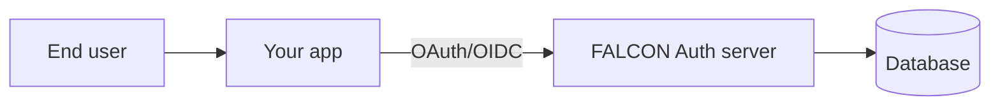

FALCON Auth is a centralized identity platform for first-party and partner applications. It is built on [Better Auth](https://www.better-auth.com/) and exposes standards-based sign-in and APIs so your apps can treat it like any other OAuth/OIDC provider.

## What you get

- **Hosted login and consent** — Server-rendered pages for sign-in, sign-up, and OAuth consent (see Quickstart).
- **OAuth 2.1 / OIDC** — Authorization Code with PKCE, refresh tokens, JWKS, discovery metadata.
- **Organizations and teams** — Multi-tenant structure with members, invitations, and teams (Better Auth organization plugin).
- **Admin operations** — User listing, creation, and impersonation for the FALCON operations team.
- **SDK** — `@falcon-auth/sdk` wraps the Better Auth client with the plugins FALCON enables.

## Architecture (high level)

Future work will deepen integration with [FALCON Connect](https://github.com/benjamin-kraatz/falcon-connect) for workflow automation.
